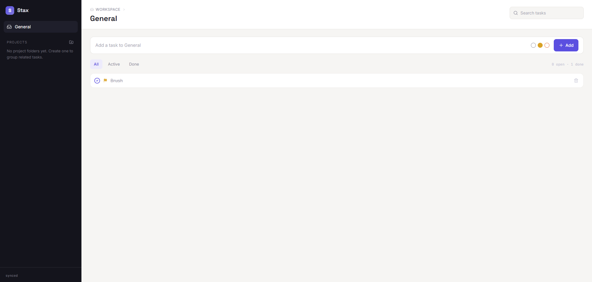
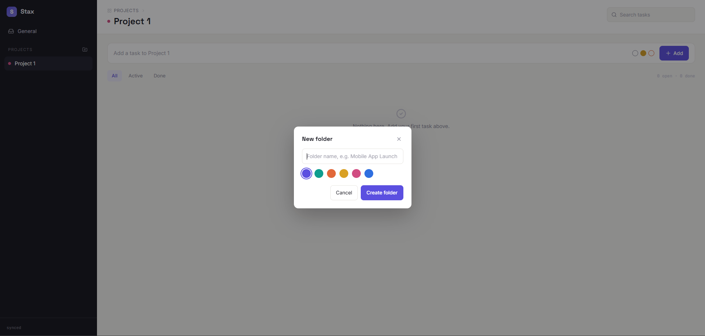

# StackX Todo

A clean, folder-based todo app built with React and Tailwind CSS.

## Features

- **Folder organization** — Group tasks into color-coded project folders
- **Priority levels** — Low, Medium, High with click-to-cycle flags
- **Inline editing** — Click any task text to rename it
- **Filter & search** — All / Active / Done tabs + live search
- **Persistent storage** — Todos and folders saved to `localStorage`
- **Responsive** — Collapsible sidebar on mobile

## Screenshots

 

## Project structure

```
src/
├── components/
│   ├── Composer.jsx      # New-todo input + priority picker
│   ├── EmptyState.jsx    # Placeholder when no tasks match
│   ├── FilterBar.jsx     # All / Active / Done filter tabs
│   ├── FolderModal.jsx   # Create / edit folder dialog
│   ├── Sidebar.jsx       # Folder nav, sync status, context menus
│   ├── TodoItem.jsx      # Single todo row with inline rename
│   ├── TodoList.jsx      # Renders list or empty state
│   └── TopBar.jsx        # Breadcrumb, page title, search
├── constants.js          # Shared colors and priority config
├── index.css             # Tailwind v4 import + custom theme
├── Stack.jsx             # App shell, state, and persistence
├── App.jsx               # Root component
└── main.jsx              # Entry point
```

## Getting started

```bash
npm install
npm run dev
```

## Build

```bash
npm run build
```
